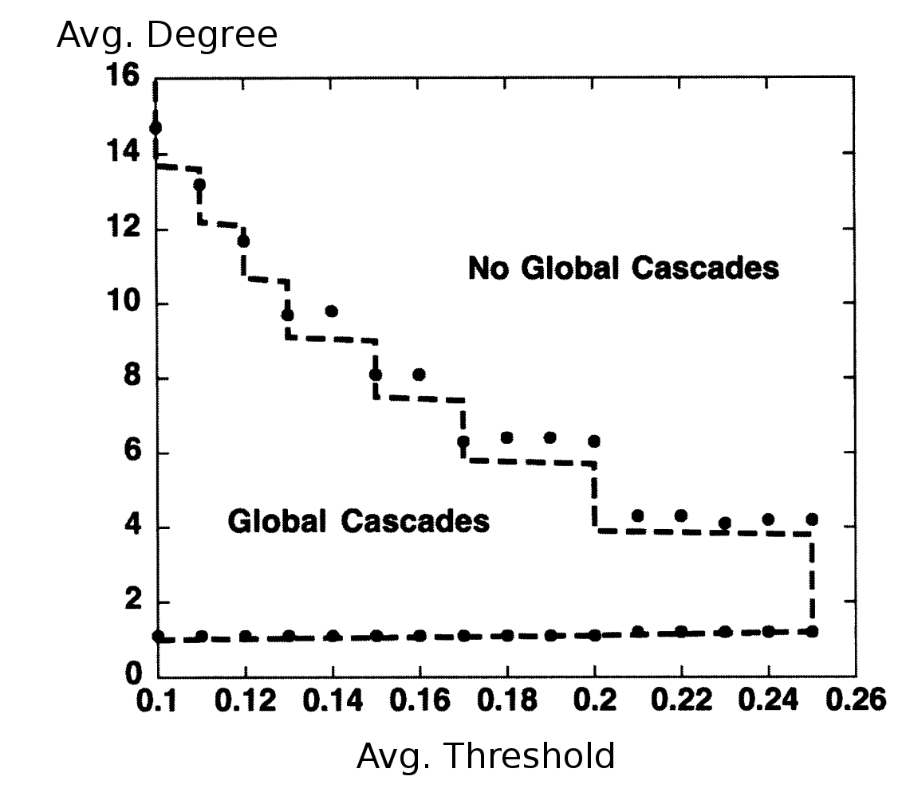

# Motivation

Network Cascades are one Explanation for Phenomena like:

* Emergence of Books, Movies and Albums
* Stock Market Fluctuations
* Social Movements
* Technology Adoption
* Infrastructure Failures

Social Applications:

* Viral Marketing: Causing a Cascade in a Social Network to Promote a Product
  * Strategy 1: Make an Exiting Product Slightly More Attractive to Cross the Tipping Point
  * Strategy 2: Convince an (Small) Strategic Group and Cause a Cascade

# Example

* A Worker has Some Bad Initial Job Interviews
* Subsequent Employers Reject the Worker Because of "Bad Signals", Despite Good Interviews

Quelle: anderson1997information

# Modeling Network Cascades

## Watts

* Binary Decision ($0$ or $1$)
* Decision Based on Relative Number of Observed Others (threshold $\Phi$)
* Thresholds can Vary Between Agents
* Number of Neighbors can Vary

Cascades Occur in Two Regimes:
  * Low Connectivity Regime: Agents have few neighbors. Power law distribution of cascade sizes.
  * High Connectivity Regime: Agents have many neighbors. Bimodal distribution of cascade sizes.

# Shortcomings (of Watts' Model)

* Personal Knowledge of Agents not Represented
* Global Adoption Rate not Considered
